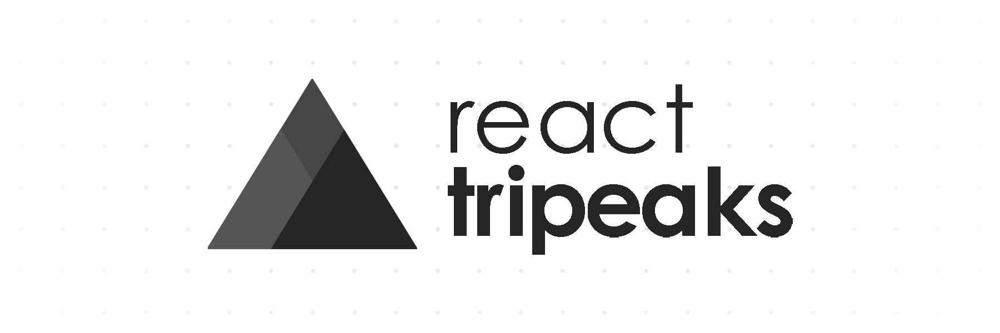

A React based implementation of TriPeaks solitaire.

## Play the game

Play it on [GitHub Pages](https://adybo123.github.io/react-tripeaks/) .

## Play with the code

If you're interested in editing the code, react-tripeaks was created with
create-react-app, so you can do a simple ```npm i``` followed by ```npm start```
after cloning to run the webpack dev server.

## Why?

Just me practising React. It is, however, a fully functional and rules-compliant
implementation of TriPeaks solitaire, with accurate deck simulation, so you can
play it if you want.

[](https://github.com/standard/standard)
